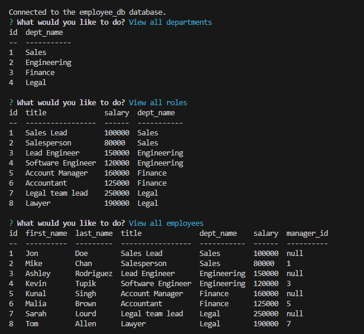

# HW-Challenge-12-Employee-Tracker

## Description

Create a command-line application that allows user to view and manage the departments, roles, and employees in a company.

## Main Objectives

- When I start the application, I am presented with the following options: view all departments, view all roles, view all employees, add a department, add a role, add an employee, and update an employee role
- When I choose to view all departments, I am presented with a formatted table showing department names and department ids
- When I choose to view all roles, I am presented with the job title, role id, the department that role belongs to, and the salary for that role
- When I choose to view all employees, I am presented with a formatted table showing employee data, including employee ids, first names, last names, job titles, departments, salaries, and managers that the employees report to
- When I choose to add a department, I am prompted to enter the name of the department and that department is added to the database
- When I choose to add a role, I am prompted to enter the name, salary, and department for the role and that role is added to the database
- When I choose to add an employee, I am prompted to enter the employee’s first name, last name, role, and manager, and that employee is added to the database
- When I choose to update an employee role, I am prompted to select an employee to update and their new role and this information is updated in the database 

## Links

Walkthrough Video: https://drive.google.com/file/d/145454R0z1_dGe_C3tclrM82Dhz0iMmrD/view

Repo: https://github.com/pg1219/HW-Challenge-12-Employee-Tracker

## Mock-Up

Preview image of deployed application

